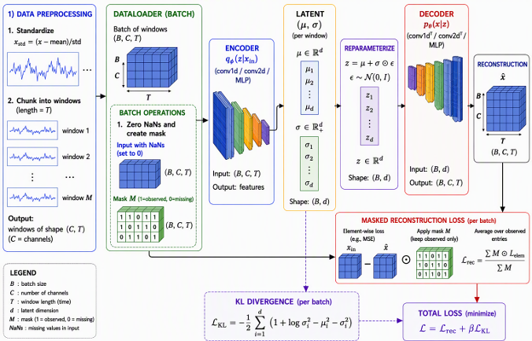
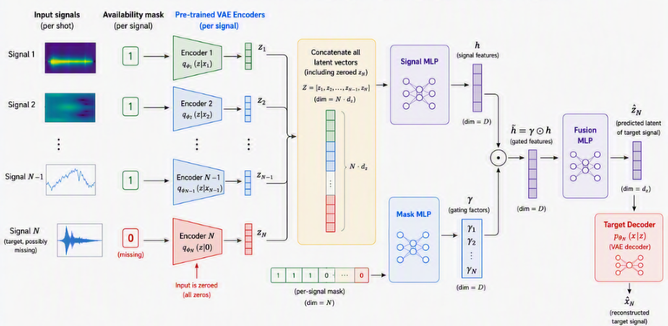

# `vae_pipeline.py` — MAST β-VAE training script

## Getting started
git clone --recurse-submodules git@github.com:UKAEA-IBM-STFC-Fusion-FMs/VAE_fairmast.git

### Create conda environment
1- Install Miniforge distribution compatible with your operative system.
2- Create conda environment:

``` 
conda create -n VAEfairmast python=3.11
```

3- Activate environment:

```
conda activate VAEfairmast
```

### Install dependencies (tokamark)
```
pip install -e tokamark
```

**Dataset:**  
The pipeline operates on the *tokamark* dataset, available at:  
https://huggingface.co/datasets/UKAEA-IBM-STFC/tokamark-dataset


**Path:** `src/vae_pipeline/vae_pipeline.py`

`vae_pipeline.py` is the CLI entry point that trains a single **β-VAE** to learn a compact
latent representation of a MAST diagnostic signal from the **TokaMark dataset**.
The entire run is driven by two files:

- a **JSON config** (`--config_file_path`) — data, model architecture, and training hyperparameters;
- a **YAML task config** (`--config_task_file_path`) — TokaMark task/windowing metadata.

A new feature of this version is the **masked loss**: the reconstruction term is computed only
over finite (valid) entries of the signal, so NaNs no longer pollute training.

## Usage

```bash
python src/vae_pipeline/vae_pipeline.py \
  --config_file_path path/to/your/config.json \
  --config_task_file_path path/to/your/config.yaml
```

## What it does, step by step

### 1. Setup (`main()`)

1. Picks the device: **CUDA** if available, otherwise CPU.
2. Parses the two config arguments.
3. Loads the JSON config into a `Settings` object via
   `get_settings()` (`src/vae_pipeline/configs/config_setup.py`).
4. Loads the YAML task config and builds TokaMark task metadata
   (`tokamark.tasks.get_task_metadata`).
5. Creates the output directory
   `SETTINGS.LOCAL_PATHS.data_output_directory + "conv1d_vae_<config_name>/"`.
6. Selects train/validation **shot IDs** from the data-split CSV
   (`get_train_test_val_shots`); shot `24623` is removed from validation.
7. Loads per-signal mean/std statistics from `dict_signals_stats.yaml`.
8. Builds a per-signal transform map (for instance):
   - `StdScalingTransform` (z-scoring with outlier cleaning) for every signal, plus
9. Builds the raw datasets (`MastDataset` via `initialize_datasets`) over the local
   zarr store, then wraps them with TokaMark's `initialize_TokaMark_dataset` and a
   `ModelSpecificTransform` that produces the `batch["x"]` tensor.
10. Creates `DataLoader`s (batch size / workers from config).
11. Instantiates the model `beta_VAE(SETTINGS)` (see below).
12. Creates an **Adam** optimizer and a
    **`CosineAnnealingWarmRestarts`** LR scheduler.
13. Saves `model.json` (architecture) and a copy of the JSON config into the output dir.
14. Calls `train_vae_model(...)` and prints elapsed time.

### 2. Model (`beta_VAE`, `src/vae_pipeline/models/vae_model.py`)

- **Encoder/decoder**: built by `EncoderDecoder`
  (`src/vae_pipeline/models/encoder_decoder.py`) — a `conv1d` stack, a `linear` stack, or a
  generic config-driven `"encoder_decoder"` stack, depending on the config.
- **Latent head**: two linear layers produce `mu` and `logvar` of the posterior
  `q(z|x)`; a reparameterized sample `z` is decoded back to signal space.
- **Input preparation**: a binary validity mask is built from finite entries, NaNs are
  imputed with 0, and `[imputed_x, mask]` are concatenated along the channel dimension,
  so the network *sees* where data is missing. Handles 1D (conv1d/linear) and 2D (conv2d)
  layouts.
- **Loss** (`masked_loss_function`):
  `total = masked_MSE + beta * KL`, where the MSE is masked to valid entries and averaged
  per-sample, and `logvar` is clamped for numerical stability.

### 3. Training loop (`train_vae_model`)

Per epoch:

1. **Train phase** — for each batch:
   - skip the batch if >25% of samples are <75% finite;
   - forward + masked loss via `training_block`
     (`src/vae_pipeline/utils/utils.py`) under **AMP** (autocast + `GradScaler` on CUDA);
   - skip batches with non-finite loss components;
   - gradient clipping (`max_norm=1`), skipping the step if the grad norm is NaN/Inf;
   - optimizer step (AMP-aware).
2. **Validation phase** — same forward + masked loss under `no_grad`, averaged over the set.
3. **Adaptive β schedule** — KL and reconstruction losses are EMA-smoothed (decay 0.7);
   after `patience` warm-up epochs, β is multiplicatively updated to keep
   `KL/recon ≈ target_scale (0.1)`, with the step clipped to ±0.2 in log space and β
   bounded to `[1e-5, 10]`.
4. **Checkpointing** — on a new best validation loss, `best_vae_<signal>.pt` is saved
   (model/optimizer/scheduler state + epoch); `last_vae_<signal>.pt` is saved every epoch;
   `loss_curves.json` stores train/val loss curves plus LR and β histories.
5. **Early stopping** — if validation loss does not improve for `patience` epochs and
   the `min_nr_epochs` floor has passed, training stops.

### 4. Outputs (in the output directory)

| File | Content |
| --- | --- |
| `best_vae_<signal>.pt` | best checkpoint (model/optimizer/scheduler state + epoch) |
| `last_vae_<signal>.pt` | last checkpoint |
| `loss_curves.json` | train/val total-recon-KL curves, LR and β history |
| `model.json` | model architecture string |
| `<config>.json` | copy of the config used for the run |

## Dependencies

The script cannot run in isolation; it depends on the following.

### Python / third-party packages

- **`torch`** (PyTorch, >= 2.x) — the core: model definition, training loop, AMP
  (`torch.amp.autocast`/`GradScaler`), `DataLoader`, Adam, LR schedulers, checkpoint saving.
- **`numpy`** — β adaptive schedule arithmetic.
- **`PyYAML` (`yaml`)** — loading the task config (via TokaMark) and the
  `dict_signals_stats.yaml` signal statistics.
- **`pandas`** (indirect, via `src/utils/utils.py`) — reading the shot-ID split CSV.
- Conda env per `environment.yml` (Python 3.11): `zarr`, `fsspec`, `s3fs`, `xarray`,
  `tqdm`, `rich`, etc. (used by the data stack below).

### In-repo modules

- `src.vae_pipeline.configs.config_setup` — `get_settings()` (JSON → `Settings`).
- `src.vae_pipeline.models.vae_model` — `beta_VAE` and `masked_loss_function`.
- `src.vae_pipeline.models.encoder_decoder` (+ `encoder_decoder_utils`) — encoder/decoder
  builders (`conv1d`, `linear`, config-driven stacks).
- `src.vae_pipeline.utils.utils` — `training_block` (one forward + masked loss step).
- `src.common_transforms.general_transforms` — `ModelSpecificTransform`,
  `StdScalingTransform`, `CropSignalFeatures`.
- `src.utils.utils` — `ComposeTransforms`, `initialize_datasets`,
  `get_train_test_val_shots`, `load_task_config`.

### External packages 

- **`MAST_tools`** — `MastDataset`, `CachedDataset`: reads raw MAST diagnostic data from
  the zarr store and applies the per-signal transforms.
- **`tokamark`** — `get_task_metadata`, `initialize_TokaMark_dataset`,
  `ReshapeLcfsTransform`, and `get_config_from_yaml` (YAML task loading). If the repo's
  `tokamark/` directory is an empty placeholder; install TokaMark separately
  (e.g. `pip install -e tokamark` as in the README).

### Data & environment dependencies

- **TokaMark dataset** (zarr) at the hard-coded local path
  `/lustre/home/bf3280/tokamark_fairmast_dataset` (used when `"local": true` in the
  config; this path is machine-specific and must exist).
- **Data-split CSV** at `SETTINGS.LOCAL_PATHS.data_split_csv_path`
  (`TokaMark_data_splits.csv`) — defines train/val/test shot IDs.
- **Signal statistics** at `SETTINGS.LOCAL_PATHS.global_mean_std_path/dict_signals_stats.yaml`
  (per-signal mean/std for z-scoring).
- The **JSON config file** and **YAML task file** passed on the command line.
- A **CUDA GPU** is optional: training works on CPU, but AMP is only enabled on CUDA.

### Model architecture



# `benchmark_pipeline.py`

# Benchmark Pipeline & Benchmark Model — Documentation

This document describes the two core files of the benchmark study in
`src/benchmark/`:

| File | Role |
|---|---|
| `src/benchmark/benchmark_pipeline.py` | End-to-end PyTorch training pipeline that trains a predictive ("benchmark") model on top of frozen, pre-trained VAE latent representations, over tasks defined in **TokaMark**. |
| `src/benchmark/benchmark_model.py` | Definition of the `BenchmarkModel` neural network: a masked, modulated MLP that maps current input latents to future target latents. |

The broader benchmark study is described in **arXiv:2602.10132**.

---

## 1. `benchmark_pipeline.py`

### 1.1 Purpose

The pipeline takes, for a given TokaMark task:

- a set of **input signals** (diagnostics) and optional **actuator** and **output** (target) signals,
- **pre-trained VAEs** (one per input/actuator signal, and optionally one per output signal),

and trains a sequence-to-sequence style benchmark model that learns to reconstruct or predict the
**latent representation of the target signals** from the **current latent
representations of the input (+ actuator) signals**. The VAEs are loaded once, put in
`eval` mode, and their weights are **never updated** — only the benchmark model is
trained. For a sketch of the model architecture see below.

###  Usage
```
python src/benchmark/benchmark_pipeline.py \
    --config_benchmark_file_path path/to/your/config.json \
    --config_task_file_path tokamark/src/tokamark/tasks_configs/group_3_profiles_dynamics/task_*.yaml
```

Arguments (parsed in `src/benchmark/utils.py::parse_args`):

| Argument | Default | Description |
|---|---|---|
| `--config_task_file_path`  | Path to the **TokaMark task YAML** file defining the task (which signals are inputs/actuators/outputs and the task windowing). |
| `--config_benchmark_file_path` | Path to the **benchmark JSON config** controlling training, paths, and model architectures. |

### 1.3 `main()` — step-by-step flow

`main()` performs, in order:

1. **Device selection**: CUDA if available, otherwise CPU.
2. **Parse CLI arguments** and load the two configuration files:
   - `load_task_config(config_task_file_path)` → plain dict `config_task` (from `src/utils/utils.py`),
   - `load_benchmark_settings(config_benchmark_file_path)` → a `SettingsBenchmark` object `SETTINGS` (from `src/benchmark/configs/benchmark_setup.py`), which validates that the JSON contains `paths`, `training`, and model sections (`signal_model`/`mask_model`/`end_model` **or** `model`) plus a `task` entry.
3. **Create the output directory**: `SETTINGS.LOCAL_PATHS.output_directory + <config file name without .json> + "/"`.
4. **Train/val/test shot split**: `get_train_test_val_shots(...)` (from `src/utils/utils.py`) reads the shot list from the CSV at `SETTINGS.LOCAL_PATHS.data_split_csv_path` and returns the first `num_train_samples` shot indices for training and the next `num_val_samples` for validation. The test split is *not* used during training (it is used separately by `benchmark_evaluation.py`).
5. **Task metadata**: `tokamark.tasks.get_task_metadata(config_task)` builds the task-specific metadata consumed by the TokaMark dataset wrapper.
6. **Signal inventory**: `source_signal_list` is the concatenation of `input_name`, `actuator_name`, and `output_name` from `config_task["sources_and_signals"]` (each entry is a `(source, signal)` tuple), de-duplicated while preserving order.
7. **Global signal statistics**: reads `<global_mean_std_path>/dict_signals_stats.yaml` — per-signal mean/std values (keyed by `"{source}-{signal}"`) pre-computed over the whole dataset.
8. **Per-signal preprocessing transforms** (`signal_transform_map`):
   - Every signal gets a `StdScalingTransform(mean, std)` (standardization; applied in `src/common_transforms/general_transforms.py`),
   - Signals whose name contains `lcfs` additionally get `ReshapeLcfsTransform` (from TokaMark) to reshape the last closed flux surface signal,
   - composed via `ComposeTransforms`.
9. **Base (MAST) datasets**: `initialize_datasets(...)` (from `src/utils/utils.py`) opens the MAST zarr dataset and returns `{"train": ..., "val": ..., "test": ...}` datasets with the per-signal transforms applied. The local zarr root is the hard-coded path `/lustre/home/bf3280/tokamark_fairmast_dataset`; `store_mast_settings` is only populated when `SETTINGS.local` is true. `cache_data=False`.
10. **TokaMark task datasets**: each base dataset is wrapped with `tokamark.data.initialize_TokaMark_dataset(dataset, task_metadata, config_metadata, custom_transform=ModelSpecificTransform(), test_mode=False, shuffle_windows=False)`. `ModelSpecificTransform` (from `src/common_transforms/general_transforms.py`) turns each sample into `{"x": [tensors of inputs + actuators], "y": [tensors of outputs]}`.
11. **DataLoaders** for train and val with `dataloader_batch_size` and `num_workers` from the config (`persistent_workers=False`).
12. **Load the frozen VAEs** via `create_vae_dictionary` (from `src/benchmark/utils.py`) into
    `vae_dictionary = {"input": {...}, "actuator": {...}, "output": {...}}`. For each signal, the function looks for a VAE config path in the corresponding list in `SETTINGS.LOCAL_PATHS` (`input_vae_models`, `actuator_vae_models`, `output_vae_models`) whose name contains the signal name, resolves it under `SETTINGS.LOCAL_PATHS.vae_directory`, loads the `beta_VAE` architecture from the config JSON and its weights from the sibling checkpoint `best_vae_<signal>.pt`, and puts it on the device in `eval` mode. All VAEs are then explicitly moved to the device.
13. **Instantiate the benchmark model**:
    - primary: `BenchmarkModel(SETTINGS)` (see §2),
    - fallback: if construction fails, a plain single MLP built with `SequentialBuilder({"layers": SETTINGS.MODEL.model_layers})` is used instead (this is the path taken by configs that define a single `model` section).
14. **Optimizer / scheduler**: `torch.optim.Adam(lr=SETTINGS.TRAINING.lr)` and `torch.optim.lr_scheduler.CosineAnnealingWarmRestarts(T_0=num_epochs, T_mult=1, eta_min=int(lr/50))`. Note `eta_min` is cast to `int`, so it is effectively `0` for typical learning rates (e.g. `5e-3`).
15. **Optional checkpoint resumption** : a ready-made block to load `best_model.pt` and restore model/optimizer/scheduler state to continue training.
16. **Artifacts saved before training**:
    - `model.json` — `str(model)` (network architecture summary) written to the output directory,
    - a byte-for-byte copy of the benchmark JSON config into the output directory (for reproducibility).
17. **Training**: calls `train_model(...)` with `use_amp=False`, `grad_clip=1`, `verbose=True`.

### 1.4 Data ingestion rules (VAE ↔ signal correspondence)

The pipeline enforces a strict one-to-one correspondence between configured signals and
VAE models (implemented in `create_vae_dictionary`, `src/benchmark/utils.py`):

- **Input signals** — a corresponding input VAE is **required** for every input signal; the pipeline also raises `ValueError("Input VAE is required.")` at the start of `train_model` if `vae_dictionary["input"]` is empty.
- **Actuator signals** — if none are configured, no actuator VAEs are needed; if any are configured, each must have a corresponding actuator VAE (mismatched counts raise `ValueError`).
- **Output signals** — outputs may be configured **without** VAEs (they are then kept in real space, flattened to 2D) or **with** VAEs (each must have a corresponding output VAE).

### 1.5 Batch processing (what the model actually sees)

Each raw batch is a dict `{"x": [...], "y": [...]}` of tensors (inputs+actuators, outputs).
`process_batch` (from `src/benchmark/utils.py`) converts it as follows:

1. **Device/dtype alignment** of all tensors with the first input VAE.
2. **Sample skimming** (`skim_batch`): a sa
mple is dropped if fewer than 50% of its input entries *or* fewer than 50% of its target entries are finite.
3. **Per-signal processing** (`process_data`):
   - *Signal with a VAE*: non-finite entries are zeroed; samples with >90% invalid entries are invalidated; the signal is encoded with the **deterministic mean latent** `model.encode(batch)[0]` (no sampling). The validity mask is *sample-level* (1 column per signal for inputs, expanded to `latent_dim` columns for targets).
   - *Signal without a VAE*: flattened to 2D `[B, -1]`, non-finite entries zeroed, with an *element-wise* finite mask.
4. **Concatenation across signals**: returns
   - `input_data` `[B, ...]`,
   - `target_data` `[B, ..]`,
   - `input_mask` `[B, ...]` (sample- or element-level validity),
   - `target_mask` `[B, ...]` (sample- or element-level validity),
   - plus clones of the skimmed original inputs/targets (used by the evaluation pipeline, not by training).

The loss is `masked_loss(reconstruction, target, target_mask)` (`utils.py`): a **masked MSE** averaged only over valid (mask == 1) target entries.

### 1.6 `train_model()` — training loop

Setup:

- `input_vae = [input VAEs] + [actuator VAEs]` and `target_vae = [output VAEs]`.
- `latent_space_size = Σ latent_dim of the input VAEs`. It is cross-checked against the `in_features` of the first `linear` layer in `SETTINGS.MODEL.signal_layers`; a mismatch raises `ValueError` (this is the only check tying the VAEs to the model config).
- `torch.amp.GradScaler('cuda', enabled=use_amp)` is created (AMP is disabled in the shipped call).

Per epoch:

1. **Training**: `model.train()`, iterate batches:
   - `process_batch` → assert equal batch dimensions across data/target/masks; skip the batch if `data is None`.
   - `optimizer.zero_grad(set_to_none=True)`.
   - Forward `model(data, input_mask)`, then `masked_loss`.
   - **Non-finite loss guard**: if the loss is not finite the batch is skipped (with AMP, gradients are unscaled first).
   - Backward through `scaler.scale(loss).backward()` + `scaler.unscale_(optimizer)` (AMP path) or `loss.backward()` (normal path).
   - **Gradient clipping**: `torch.nn.utils.clip_grad_norm_(model.parameters(), max_norm=grad_clip)`; a NaN/Inf grad norm causes the step to be skipped (AMP scaler still updated).
   - Optimizer step (`scaler.step`/`scaler.update` under AMP, otherwise `optimizer.step()`); running train loss accumulated.
2. **Scheduler step** — once **per epoch** (not per batch).
3. **Validation**: `model.eval()` + `torch.no_grad()`, same batch processing, non-finite losses skipped, average validation loss computed.
4. **Best-model tracking & early stopping**:
   - if `avg_val_loss < best_val_loss`, save a checkpoint `best_model.pt` to the output directory containing `model_state_dict`, `optimizer_state_dict`, `scheduler_state_dict`, and `epoch`, and reset the no-improvement counter,
   - otherwise increment `epochs_no_improvement`; training stops early once `epochs_no_improvement >= patience` and `epoch > min_nr_epochs`.
5. **Loss curves**: after every epoch, `loss_curves.json` with `train_losses` and `val_losses` (per-epoch averages) is (re)written to the output directory.

### 1.7 Outputs

All artifacts are written to `<output_directory>/<config_file_stem>/`:

| File | Content |
|---|---|
| `best_model.pt` | Best checkpoint (model / optimizer / scheduler state + epoch). |
| `loss_curves.json` | Per-epoch train and validation loss. |
| `model.json` | `str(model)` — textual architecture summary. |
| `<config_file>.json` | Copy of the benchmark config used for the run. |

---

## 2. `benchmark_model.py`

### 2.1 Purpose

`BenchmarkModel` is the trainable network of the benchmark. It takes as
input:

- `signal`: the concatenation of latent representations produced by the frozen input/actuator VAEs (and flattened real-space inputs where no VAE exists), shape `[B, D_in]`;
- `mask`: the corresponding validity mask, shape `[B, n_input_signals]`.

and outputs the predicted future representation of the target signals, shape `[B, D_out]`.

### 2.2 Architecture

The model is composed of three MLPs, each built by `SequentialBuilder` (from
`src/utils/layer_factory.py`) from a list of layer specs in the config:

| Sub-network | Config key | Function |
|---|---|---|
| `signal_mlp` | `signal_model.layers` | Encodes the input latents `signal` into hidden features `h_signal`. |
| `mask_mlp` | `mask_model.layers` | Encodes the validity `mask` into modulation coefficients. |
| `fusion_mlp` (`end_mlp`) | `end_model.layers` | Prediction head: maps the modulated hidden features to the target output. |

`SequentialBuilder` instantiates each entry `{"type": <name>, "params": {...}}` through a
layer registry (`LayerFactory`) that supports `linear`, `conv1d/2d`, `relu`, `leaky_relu`,
`gelu`, `tanh`, `sigmoid`, `layer_norm`, `batch_norm1d/2d`, dropout, pooling, etc.

### 2.3 Mask modulation (the key mechanism)

In `forward`:

```python
h_signal = self.signal_mlp(signal)
h_mask   = self.mask_mlp(mask)
```

The mask features then modulate the signal features feature-wise:

- If `h_mask` has width **2 × width(h_signal)**: it is split (`torch.chunk`) into
  `gamma` and `beta`, and
  **`h = (1 + gamma) * h_signal + beta`** — an affine (FiLM-style) modulation by the
  validity mask.
- If `h_mask` has width **1 × width(h_signal)**: element-wise scaling,
  **`h = h_mask * h_signal`** (a single learned per-feature gain).
- Any other width raises `ValueError`.

The modulated `h` is then passed through `fusion_mlp` to produce the prediction `y`.

### 2.4 Constructor and config validation

- Builds the three `SequentialBuilder` stacks from `SETTINGS.MODEL.signal_layers`,
  `SETTINGS.MODEL.mask_layers`, `SETTINGS.MODEL.end_layers`.
- Infers dimensions by scanning each stack for `linear` entries:
  - `signal_in_features` = `in_features` of the **first** linear layer (must equal the total VAE latent size, enforced by the *pipeline*, not the model),
  - `signal_out_features` / `mask_out_features` / `end_out_features` = `out_features` of the **last** linear layer of each stack,
  - `end_model_in_features` = `in_features` of the first linear layer of the end stack.
- Raises `ValueError` if any stack contains no `linear` layer (dimensions undeterminable).
- Raises `ValueError` unless `mask_out_features` is either `2 × signal_out_features`
  (gamma+beta regime) or `1 × signal_out_features` (gamma-only regime).

> **Note:** the constructor validates mask↔signal consistency but does **not** validate
> that `end_model_in_features == signal_out_features` (i.e. the output of the signal
> branch and the first linear of the end branch must agree — a mismatch only surfaces at
> runtime in `forward`). Configs must therefore keep these dimensions consistent manually.

### 2.5 Fallback model

`benchmark_pipeline.py` wraps the construction in a try/except: if
`BenchmarkModel(SETTINGS)` raises (e.g. a config defines only a single `model` section
with no signal/mask/end sections), a plain sequential MLP
`SequentialBuilder({"layers": SETTINGS.MODEL.model_layers})` is used instead, printing
`USING single MLP model as a benchmark model`.

### 2.6 Minimal config example

`src/benchmark/configs/task1_1_config.json` illustrates a full configuration: 8 input
signals each compressed by a VAE (total latent size 93 → `signal_model` in_features), 8
mask columns (one per input signal) processed by `mask_model`, and an `end_model`
producing the 17-dim target representation.


## 3. Benchmark JSON config reference

All keys and where they are consumed:

### `training` (→ `TrainingSettings`)

| Key | Used by |
|---|---|
| `lr` | Adam optimizer; also `eta_min = int(lr/50)` of the cosine scheduler. |
| `num_epochs` | Epoch loop; `T_0` of the cosine scheduler. |
| `min_nr_epochs` | Earliest epoch at which early stopping may trigger. |
| `patience` | No-improvement counter threshold for early stopping. |
| `dataloader_batch_size` | Both DataLoaders. |
| `num_workers` | Both DataLoaders. |
| `num_train_samples` | Number of leading train shot indices taken from the split CSV. |
| `num_val_samples` | Number of validation shot indices taken after the train ones. |

### `paths` (→ `LocalPaths`)

| Key | Used by |
|---|---|
| `data_split_csv_path` | Shot split CSV (e.g. `tokamark/src/tokamark/metadata/TokaMark_data_splits.csv`). |
| `global_mean_std_path` | Directory containing `dict_signals_stats.yaml` (per-signal mean/std). |
| `vae_directory` | Root directory for the pre-trained VAEs. |
| `input_vae_models` | List of VAE config sub-paths (each resolves to `<vae_directory>/<sub_path>` + `best_vae_<signal>.pt`) for **input** signals. |
| `actuator_vae_models` | Same, for **actuator** signals (may be empty). |
| `output_vae_models` | Same, for **output** signals (may be empty → real-space targets). |
| `output_directory` | Root for all run artifacts. |

### Model sections (→ `Models`)

- `signal_model.layers`, `mask_model.layers`, `end_model.layers` — layer specs consumed by `BenchmarkModel` (each entry `{"type": ..., "params": {...}}`).
- `model.layers` — alternative single-MLP spec used by the fallback path.

### Top-level

| Key | Default | Used by |
|---|---|---|
| `task` | required | Identifies the TokaMark task number. |
| `local` | `True` | Controls MAST store settings passed to `initialize_datasets`. |
| `cache_data` | `False` | (stored as `SETTINGS.cache`) |
| `output_signals_len` | `None` | Expected target output length(s) (used by the evaluation side). |

---

## 4. Dependencies

### 4.1 `benchmark_pipeline.py`

**Python standard library**
- `argparse`, `json`, `os`, `sys`, `typing` (List)
- `warnings`, `torch.nn.functional` (imported, currently unused)

**Third-party packages**
- `torch` — tensors, `DataLoader`, `optim.Adam`, `CosineAnnealingWarmRestarts`, `amp.GradScaler/autocast`, checkpointing.
- `yaml` (PyYAML) — loading `dict_signals_stats.yaml`.
- (indirectly, via the dataset stack) `zarr`, `xarray`, `fsspec`/`s3fs`, `numpy` — see `environment.yml`.

**TokaMark (git submodule)** — `https://github.com/UKAEA-IBM-STFC-Fusion-FMs/tokamark.git` (path `tokamark/`; initialize with `git submodule update --init`):
- `tokamark.tasks.get_task_metadata`
- `tokamark.data.initialize_TokaMark_dataset`
- `tokamark.tools.transforms.reshape_lcfs_transform.ReshapeLcfsTransform`


**External data / files required at runtime**
- TokaMark task YAML (e.g. `tokamark/src/tokamark/tasks_configs/group_*/task_X-Y.yaml`)
- Benchmark JSON config (e.g. `src/benchmark/configs/task1_1_config.json`)
- Data split CSV at `paths.data_split_csv_path`
- `dict_signals_stats.yaml` at `paths.global_mean_std_path`
- Pre-trained VAEs under `paths.vae_directory`: per-signal `<...>_config.json` + `best_vae_<signal>.pt`
- MAST zarr dataset at the hard-coded path `/lustre/home/bf3280/tokamark_fairmast_dataset` 

### 4.2 `benchmark_model.py`

**Python standard library**
- `os`, `sys` (repo-root `sys.path` bootstrap only)

**Third-party packages**
- `torch`, `torch.nn`

**Runtime requirements**
- A `SettingsBenchmark` object (built from the benchmark JSON config) with populated
  `MODEL.signal_layers`, `MODEL.mask_layers`, and `MODEL.end_layers`.

### 4.3 Environment

- Conda environment defined in `environment.yml` (`VAE_fairmast`), Python 3.11.
- Key pinned/relevant packages: `torch`, `numpy`, `zarr==3.0.2`, `xarray`, `fsspec==2025.3.0`, `s3fs==2025.3.0`, `scikit-learn`.
- The project is packaged via `pyproject.toml` (setuptools, `src` layout, packages `vae_pipeline*` and `benchmark*`); hardware: runs on CPU or CUDA GPU (auto-detected).


### Benchmark model architecture

